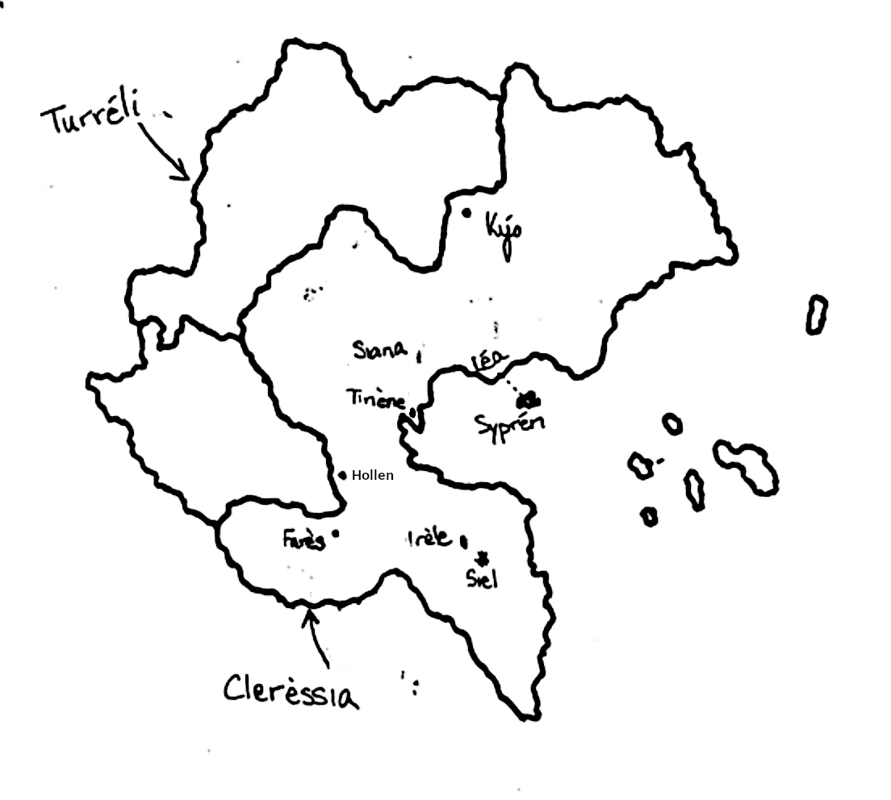

# MAGI

## Navigation

### Calendar

- [Timeline](./calendar/timeline.md)
- [Calendar Info](./calendar/info.md)
- [`cleressian_date` module](./calendar/cleressian_date.py)

### Characters

- [Amara Minori](./characters/Amara%20Minori.md)
- [Calleni Rena](./characters/Calleni%20Rena.md)
- [Molva Atris](./characters/Molva%20Atris.md)
- [Molva Iselle](./characters/Molva%20Iselle.md)
- [Molva Natalia](./characters/Molva%20Natalia.md)

## Summary

### I: The Past Chases the Present

Amara Minori, our narrator and protagonist, wakes up from a nightmare early in the morning. Staring in the mirror, she activates her Maiden transformation before collapsing in grief and anguish. A few hours later, she heads to school, where she's distracted and even more distant than usual. The boy sitting next to her in class, Molva Atris, takes note and joins her on the school for lunch, where she eventually reveals that one year ago, to the day, her best friend, Calleni Nia, died. Trying to help her put a positive spin on the day, he invites her to the picnic that he and his younger sister, Iselle, are planning to have after school.

By the time the school day ends, she has decided to go with them, meeting Iselle in her classroom for the first time before they leave for the picnic. Because Minori is such an enigma, having transferred to their school and having never spoken about her past, Iselle decides to ask about it and, to their surprise, Minori decides to answer, revealing that Nia was killed in a terrorist attack only minutes after the two had parted ways.

Suddenly, she gets a phone call from Kaskei Ari, her former handler from when she worked for the military's Magical Combat Assist unit. Ari informs her of a planned attack at the train station near her in just over half an hour, insisting that she is the only one he trusts to stop it from happening. As her emotions (and magical power) flow through her, the power also flows through her keystone necklace that Iselle is holding. To both girls' surprise, Iselle can sense this power, though she can't identify it. But without time to explain, Minori rushes off to the train station.

### II: Same, Yet Different

Minori approaches the station, activating her powers (but not her transformation) as she nears it. There, Ari tells her how his official orders are to ignore the threat, but it's something that neither he nor Minori are willing to ignore. Eventually, she finds the suspect with a backpack full of explosives, temporarily disables them, and detains the suspect until Ari arrives to take him away. He tries to make conversation with her, but she can see through to his implied desire for her to rejoin the unit and her subsequent coldness turns the conversation quiet and awkward, though she agrees to be kept up to date on his investigation.

After Ari has left, Minori releases her powers and returns to the train station, having decided on a whim to return back to Siel, where she lived before transferring to Irèle. There, she wanders the streets before finding herself in front of a flower shop, deciding to buy a bouquet of flowers to take to Nia's grave. To her surprise, Nia's younger sister, Rena, is also at the cemetery, and she invites Minori over for dinner. After Minori's short conversation with a copy of Nia in her head, she goes with Rena, and the two reconnect after their long separation, eventually promising to maintain closer contact going forward. In particular, Rena reveals that she's joined her middle school's choir club and invites Minori to the upcoming recital.

### III: A New Confidante

The next morning, Minori (back in Irèle) goes to Iselle's classroom looking for her. When the younger student shows up, Minori asks her to join her on the roof for lunch that day, intending to both determine Iselle's Maidenship and to (embarrassedly) express her interest in spending more time together. Iselle agrees.

In her own classroom, she apologizes to Atris for running off the day before, giving a technically-true-but-misleading explanation for her departure. At lunch, she rejects his offer to join her, insisting that today, she needs the empty space. Before Iselle arrives on the roof, Minori is cast back to four years prior, when she first found out that she was a Maiden, reexperiencing the confusion and uncertainty before she learned the truth about her powers.

When Iselle arrives, Minori keeps her promise to herself to ask the younger student to spend more time together before bringing the subject to the important matter at hand, testing Suzuko's sensitivity to the flow of magic, which only other Maidens can passively detect. Unsurprisingly, she passes these tests, and after Minori ensures that this will stay a secret between them, she activates her full transformation, casting a soundproof ward around them. Iselle is understandably confused and frightened as Minori begins explaining that they are both Maidens.

When she learns that her powers are still sealed (and only other Maidens can unseal them), she asks if Minori will do so, though Minori refuses, saying

> I could. I'm not going to, though. At least, not yet. [...] If I were to unseal you, I'd have to report it, and it feels like there's something big starting to happen, especially around the agency. Don't know what, yet, but you'd end up dragged into the ensuing whirlwind, and you don't want that, trust me.

As justification for this decision, Minori cites the hardships she's endured as a member of the MCA forces and says that after Nia's death, she left the MCA and her magical powers, looking for a normal life, but even then, it caught up to her, and she doesn't feel comfortable putting anyone else through that.

Iselle, somewhat understanding, attempts to console her, promising to do her best to at least give Minori a more normal social life with a new friend. She gives her a piece of paper with her phone number on it, insisting that they address each other using their first names as Minori's first training exercise (though they do maintain their normal honorifics).

### IV: In Concert

### V: A New Era

### VI: Language of the Fae

<!--

# Chapter 4
## A More Well-Planned Visit

The day before Kaida's choir club performance, Minori searches her closet for something to wear to the event. However, she gets distracted by a journal that she used to keep intermittently, with the last two entries being the day of Ikuri's funeral and several days before. Against her instincts, she forces herself to avoid the melancholic rumination the journal is about to bring on.

The next day, she meets Suzuko at Kamakura train station, and they head to Fujisawa. There, on the way to the school, Minori notices a crowd gathering around a sign near a storefront: an informational poster about the Great Enlightened Kyonshii Order (G.E.K.O.). With "geckos" the only real clue that Itou has uncovered regarding the Kamakura train station incident the week before and with the uniformly devilish stories of the Kyonshii, Minori panickedly informs Itou of her find but declines to act until more information is discovered.

> Do your magic with that information, and then we'll talk about using mine.

Once the two girls resume their walk toward the school, Minori explains the situation to Suzuko, who seems disappointed that the older student isn't going to do anything now that she knows about G.E.K.O. and once again offers her service as a Maiden, though Minori shuts her down again.

> MINORI: "You don't want to be involved. It's not all rainbows and sunshine."
> SUZUKO, *inaudible*: "Well, neither are you."

The conversation regains a tenseness until the girls are waiting in the middle school's auditorium, where Suzuko asks Minori if she has any summer break plans. When she says no, Suzuko invites her to travel parts of western Japan with her since Hideyo won't go with her. Minori accepts.
 -->
